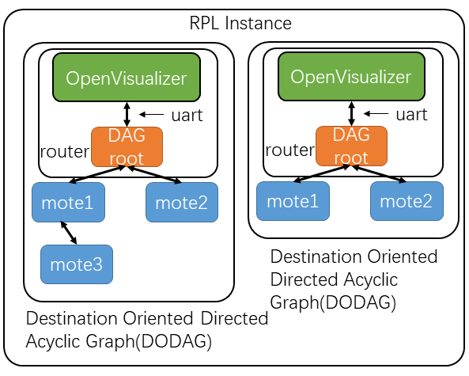
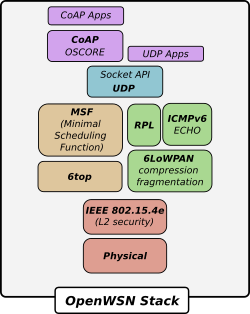
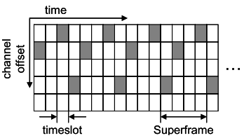
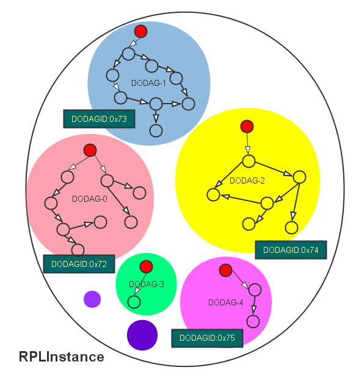
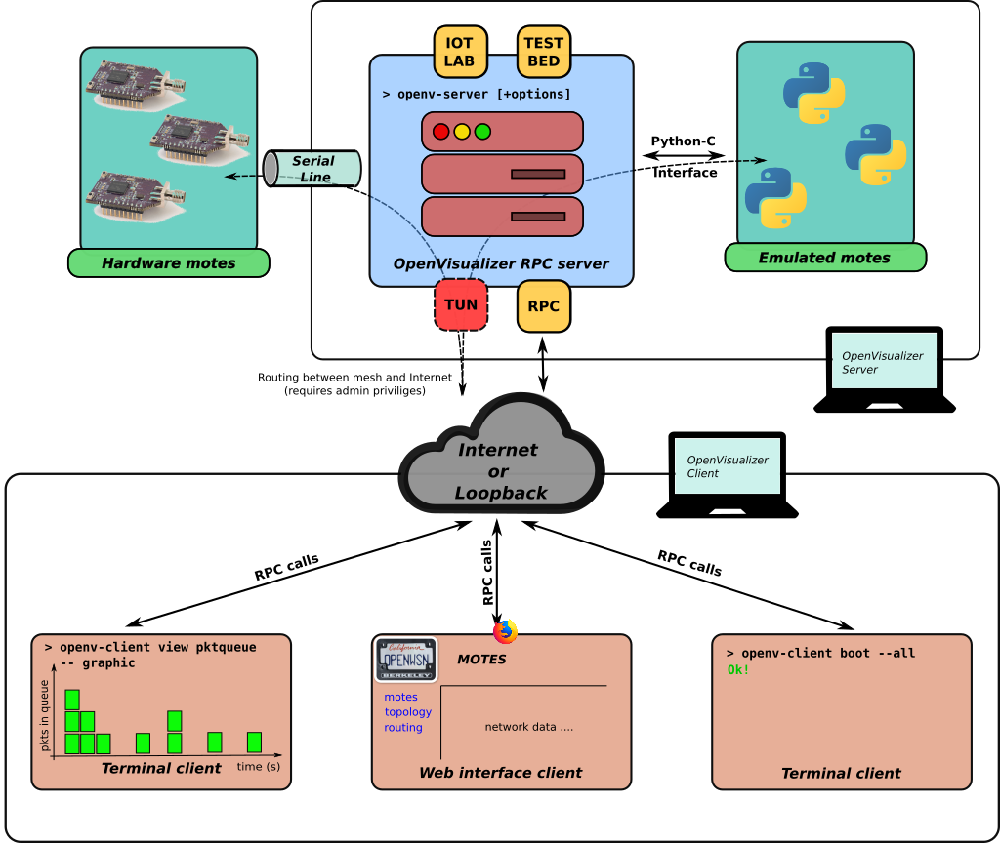

# Openwsn Tutorial

The OpenWSN project is an open-source implementation of a fully standards-based protocol stack for capillary networks, rooted in the new IEEE802.15.4e Time Synchronized Channel Hopping standard. IEEE802.15.4e, coupled with Internetof-Things standards, such as 6LoWPAN, RPL and CoAP, enables ultra-low power and highly reliable mesh networks which are fully integrated into the Internet. The resulting protocol stack will be cornerstone to the upcoming Machine-to-Machine revolution.  
[IEEE802.15.4 protocol implement](https://blog.csdn.net/weixin_40551669/article/details/89355384)  

## write style

*list  
+reference paper/book  
----分割线  

----

## Table of Contents
* [Instruction](#Instruction)
* [6TiSCH Architecture](#6TiSCH Architecture)
    + [openstack](#openstack)
        - [IEEE802.15.4](#IEEE802.15.4)
        - [IEEE802.15.4e](#IEEE802.15.4e)
        - [6top](#6top)
        - [Schedule](#Schedule)
        - [6LoWPAN](#6LoWPAB)
        - [RPL](#RPL)
        - [UDP](#UDP)
        - [CoAP](#CoAP)
    + [openVisualizer](#openVisualizer)
           
    
# Instruction

The Internet of Things (IoT) and Machine-to-Machine (M2M) revolutions are quietly coming, and with them an
epochal turning point in the way people interact with the “things” surrounding them: appliances in a smart home, snow-level sensors in a smart ski resort, overflow sensors in a smart refinery, etc. Standardization bodies are playing a key role in this revolution.   

## Motivation
The goal of the OpenWSN project is to provide **open-source implementations** of a complete protocol stack based on Internet of Things standards, on a **variety** of software and hardware platforms. This implementation can then help **academia and industry** verify the applicability of these standards to the Internet of Things, for those networks to become truly ubiquitous.   

OpenWSN project also provides solution for **investigating the use of IEEE802.15.4e** in Internetconnected low-power mesh networks. It shows how, contrary to common belief, IEEE802.15.4e (and more generally time synchronized channel hopping protocols) can be implemented on off-the-shelf platforms, **without the need of dedicated hardware**.    

OpenWSN is a **“pure C”** implementation, i.e. no extensions to the C language are needed. It is therefore not tied to any specific tool chain. The IEEE802.15.4e implementation runs in **interrupt context** for **timing accuracy**, and is **independent from the operating system** running on the mote. This implementation can therefore **easily be ported** to other operating systems. Finally, it implements, on top of IEEE802.15.4e, Internet-of-Things standards such as IPv6 over Low power Wireless Personal Area Networks (6LoWPAN), Routing Protocol for Low power and Lossy Networks (RPL) and Constrained Application Protocol (CoAP), enabling an OpenWSN network to connect seamlessly to the IPv6 Internet.    

----

# Architecture

||
|:----------------------------------------:|
|RPL Instance|

----

# openstack

||
|:-------------------------:|
|openstack architecture|

----

# IEEE802.15.4
**PHY Layer**  
The physical layer converts data bits into signals that are transmitted and received over the air. In the openwsn(6TiSCH) example, IEEE 802.15.4 is used.   

In addition to the well-rounded 2006 version(the last version is 2015) of the standard, two important amendments exist:e and g.  

+ IEEE802.15.4e, openwsn uses
+ IEEE802.15.4g is a PHY (or physical layer amendment and aims to provide an additional range of radio frequency bands to enable worldwide use even in the Sub-1 GHz frequency bands.  

**Reference**  

+ "IEEE Standard for Low-Rate Wireless Networks," in IEEE Std 802.15.4-2015 (Revision of IEEE Std 802.15.4-2011) , vol., no., pp.1-709, 22 April 2016, doi: 10.1109/IEEESTD.2016.7460875.

----

# IEEE802.15.4e
**Data link layer--MAC(Media Access Control) layer**  
The data link layer provides a reliable link between two directly connected nodes by detecting and correcting errors that may occur in the physical layer during transmission and receiving. The data link layer includes the media access layer (MAC) which provides access to the media, using features like carrier sense multiple access – collision avoidance(CSMA-CA) where the radio listens that no one else is transmitting before actually sending data over the air. This layer also handles data framing. In 6TiSCH example, the MAC layer is IEEE802.15.4e(MAC amendment). The 6LoWPAN adaption layer, providing adaption from IPV6 to IEEE802.15.4,also resides in the link layer.  

IEEE 802.15.4e is a IEEE802.15.4-2006 **MAC amenement** and provides enhancements such as time slotted channel hopping (TSCH) and coordinated sampled listening (CSL). Both enhancements aim to further lower the power consumption and make the interface more robust (better suport to industral markets) . The key element of the solution proposed by 802.15.4e is **channel hopping**, which significantly increases robustness against external interference and persistent multi-path fading.   

## TSCH
    
Full name implies-"Time slotted channel hopping"-This solution comes from TSMP(Time Synchronized MEsh Protocol).  

TSCH is the mode of the IEEE802.15.4-2015 MAC layer. Time is divided into slots; an Absolute Slot Number (ASN) is incremented at each slot and shared by all nodes. At each new slot, the frequency to be used is calculated using the equation below. channelOffset is a number between 0 and 15 which is assigned to each slot during reservation. 100 slots form a slotframe; this slotframe repeats over time.  

frequency = (ASN + channelOffset)%16  

* ASN is the absolute slot number
* channel offset is the link's y-value in the slot-channel matrix
* frequence is the channel number of radio(in IEEE802.15.4 the channel set is {0,1,...15},each channel corresponds to a different frequency)

During reservation, one of the slots in the slotframe of node A may be reserved for sending data to B at a given channelOffset. Every 100 slots, A can thus send to B at a frequency calculated with the equation above. The key is that ASN is incremented at each slot, so subsequent**packets are sent at different frequencies**.  
    
||
|:-----------------------------------------------:|
|slot-channel matrix for a network with 5 channels.Each cell can contain one transaction.|

**Reference**  

+ Doherty K S J P L . TSMP: Time Synchronized Mesh Protocol[J]. Proc of Pdcs, 2008.

### Channel Hopping

**Motviation**  
WSNs face the challenge of ensuring reliable communication over inherently unreliably links. External interference and multi-path fading cause the quality of wireless links to change dramatically in an unpredictable way. These phenomena change depending on the frequency the nodes are communicating on. Channel hopping is a technique proven to efficiently combat the unreliable nature of wireless.  

**solution**   
In a communicating system, channel hopping should be used. In a channel hopping system, subsequent packets are sent at a different frequency, following a pseudo-random hopping pattern. This means that, if a transmission fails, retransmission will happen on a different frequency. And because a different frequency means different effects of multi-path fading and interference, this means that the transmission has a greater chance of being successful that if the retransmission happened on the same channel.  

**Reference**  
For more information of how channel hopping combats external interference, please read:  

+ Thomas Watteyne, Ankur Mehta, Kris Pister. "Reliability Through Frequency Diversity: Why Channel Hopping Makes Sense". Sixth ACM International Symposium on Performance Evaluation of Wireless Ad Hoc, Sensor, and Ubiquitous Networks (PE-WASUN), Tenerife, Canary Islands, Spain, 26-30 October 2009.
+ Branko Kerkez, Thomas Watteyne, Mario Magliocco, Steven Glaser, Kris Pister. "Feasibility Analysis of Controller Design for Adaptive Channel Hopping". First International Workshop on Performance Methodologies and Tools for Wireless Sensor Networks (WSNPerf), Pisa, Italy, 23 October 2009.
+ Thomas Watteyne, Steven Lanzisera, Ankur Mehta, Kris Pister. "Mitigating Multipath Fading Through Channel Hopping in Wireless Sensor Networks". IEEE International Conference on Communications (ICC), Cape Town, South Africa, 23-27 May, 2010.
    
### Time into slot 
Just link TDMA(Time division multiple access), time is divided up into discrete time slots (default is 10ms) long enough for any single transaction. The longest transaction is one where the sender transmits the maximum length packet and the receiver acknowledges it. Every node in the network must agree on the number of time slots since the beginning of the network (the Absolute Slot Number, or ASN).  

A _superframe_(in IEEE802.15.4e_TSCH called **slotframe**) superframe is a collection of cells repeating at a constant rate. individual cells Events are scheduled to happen in in a superframe and the network is configured to support these events with periodicity equal to the superframe length. With a 10ms slot, a cell in a 1000-slot superframe(slotframe) repeats every 10s. A cell in a shorter superframe is representative of more bandwidth as it repeats more frequently. In TSMP, the superframe(slotframe) is the translation of the logical data-flows of the graph into the physical communication schedule for the network. Typically, a network will have several graphs with different superframe(slotframe) lengths. In a network of a single superframe, however, a no-collision guarantee can be trivially made by assigning only one event per cell.  

**Reference**  

+ Doherty K S J P L . TSMP: Time Synchronized Mesh Protocol[J]. Proc of Pdcs, 2008

### collision and interference
In 802.15.4e networks,**all the links are half duplex links**, which means a node cannot transmit and receive at the same time and it cannot receive from multiple nodes at the same time either. 

**Reference**  

+ Transmission Scheduling of Periodic Real-Time Traffic in IEEE 802.15.4e TSCH-Based Industrial Mesh Network

----

# 6top
**Data link layer--MAC layer(over IEEE802.15.4e)**  

6TiSCH defines the _6TiSCH Operational sublayer (6top)_, a thin 2.5 layer (above MAC) that provides management and control primitives to bind the asynchronous IP layer to the synchronous IEEE802.15.4 TSCH MAC. The protocol supports agreement on a schedule between neighbors, enabling distributed scheduling. Table III lists the commands 6P supports  

----

# Schedule
**Data link layer--MAC layer(over 6top)**  

6P goes hand-in-hand with a Scheduling Function (SF), the policy that decides how to maintain cells and trigger 6P transactions. The Minimal Scheduling Function (MSF) is the default SF defined by the 6TiSCH WG.  
    
## MSF
Full name implies-"Minimal Scheduling Function"  

MSF extends the minimal schedule configuration, and is used to add child-parent links according to the traffic load. The policy defines two types of cells referred as Autonomous Cells and Negotiated Cells. Autonomous Cells provide connectivity to any neighbor without requiring any signaling. Negotiated cells in its turn, are handled by the 6P protocol and installed or removed from the schedule following a reactive traffic-based policy.  

**Reference**  

+ T. Chang, M. Vucinic, S. Duquennoy, D. Dujovne, and X. Vilajosana, 6TiSCH Minimal Scheduling Function (MSF), Internet Engineering Task Force Std. draft-ietf-6tisch-msf-06, August 2019.

## OTF
Full name implies-"On-the-fly".  

The On-The-Fly (OTF) bandwidth reservation module plays a complementary role; it is a distributed approach for adapting the scheduled bandwidth to network requirements.   

On-The-Fly (OTF) bandwidth reservation is a solution for distributed scheduling. Based on a bandwidth allocation algorithm, OTF dynamically matches the scheduled bandwidth between pairs of sensor motes to the actual traffic load. OTF decides when to add/delete resources, and the 6top sublayer then makes the appropriate changes to the TSCH schedule. The range of application domains where OTF can be applied spans from semi-centralized systems (in which a rapid reaction is needed when a surge in bandwidth is detected) and fully distributed systems (where neighbor motes negotiate bandwidth with one another without the intervention of a Path Computation Element, PCE).  

**Reference**    

+ D. Dujovne, L. A. Grieco, M. R. Palattella, and N. Accettura, 6TiSCH On-the-Fly Scheduling, IETF Std. draft-dujovne-6tisch-on-the-fly-06 [work-in-progress], 4 July 2015.
+ Palattella M R , Watteyne T , Wang Q , et al. On-the-Fly Bandwidth Reservation for 6TiSCH Wireless Industrial Networks[J]. IEEE Sensors Journal, 2015, 16(2):550-560.

----

# 6LoWPAN
**Data link layer--Adaptat layer**  

Full name implies-"ipv6 over Low-Power Wireless Personal Area Networks"– 6LoWPAN is a networking technology or adaptation layer that allows IPv6 packets to be carried efficiently within small link layer frames, such as those defined by IEEE 802.15.4.  

**Motivation**  
IPV4 uses 32-bit address, which limits the address spce to 4,294,967,296 unique address and the addresses are about to run out.IPv6 covers an address space of 2128 and 3.4*1038 unique addresses. This should be enough for Internet to scale for decades to come – even with the promise of the Internet of Things, which according to estimates might include 50 billion connected devices by the year 2020.To recognize the increase in bandwidth, IPv6 increases the minimum maximum transmission unit (MTU) from 576 to 1280 bytes.  

On the other hand, IEEE 802.15.4 was designed to serve a different market; long-lived applications that require large numbers of low-cost, ultra-lowpower devices. The throughput under this standard is limited to 250 kbps, and the frame length is limited to 127 bytes to ensure low packet and bit error rates in a lossy RF environment. Additionally, IEEE 802.15.4 uses two addresses: a 16-bit short address and an _EUI-64 extended address_. These addresses reduce header overhead and minimize memory requirements.  

Due to the above resource constraints and 6LoWPAN multi-hop topology, supporting IPv6 over IEEE 802.15.4 networks present several challenges;  

1. IPv6 datagrams are not a natural fit for IEEE 802.15.4 networks.
2. Since IEEE 802.15.4 is both low power and low throughput, in addition to the use of RF as media, it is more prone to spurious interference, link failures and asymmetric links (A can hear B, but B cannot hear A. Those characteristics require the network layer to be adaptive and responsive at the same time as low power and efficient.
3. The most common network topology for 6LoWPAN is a low-power mesh network.

**Solution**  

The main focus of the IETF working group, 6LoWPAN WG, was to optimize the transmission of IPv6 packets over low-power and lossy networks (LLNs** such as IEEE 802.15.4 and led to the publication of RFC 6282 specifying;  

1. Header compression  
2. Fragmentation and reassembly  
3. Stateless and configuration  

**Reference**  

+ 6LoWPAN demystified  
    
## IPHC
Full name implies-"IP header compression".  

IPHC effectively compresses of Unique Local, Global, and multicast IPv6 Addresses based on shared state within contexts. In addition, it introduces a number of additional improvements over the header compression format defined in RFC4944(RFC4944 is insufficient for most practical uses of 6LoWPAN networks**. IPHC also defines NHC, an encoding format for arbitrary next headers. IPHC indicates whether the following header is encoded using NHC. If so, the bits immediately following the compressed IPv6 header start the NHC encoding. NHC adds the capability to elide the UDP checksum, which enables to save an additional pair of octets. NHC also enable compression of IPv6 Extension Headers.  

**Reference**  

+ https://openwsn.atlassian.net/wiki/spaces/OW/pages/688149/6LoWPAN  
+ RFC2507 IP Header Compression  

----

# RPL
**IP/routing/network layer**  
The network layer addresses and routes data through the network, if needed over several hops. IP (or Internet Protocol) is the networking protocol used to provide all devices with an IP address to transport packets from one device to another.  

||
|:-----------------------------------:|
|RPL Instance|

RPL是组网协议，利用四个专用ICMPv6代码：  

* DODAG information solicitation(DIS),
* DODAG information Object(DIO),
* Destination Advertisement Object(DAO), 
* Destination Advertisement Object Acknowledge(DAO-ACK).   

DIS和DIO消息用于形成网络拓扑，并启用默认的向上路由，而DAO和DAO-ACK用更具体的向下路由填充生成的DODAG。 更具体地说：DIS消息用于节点从（一组）邻居请求路由信息。  DIO消息用于节点从根开始构建DODAG，并向（一组）邻居通告默认值以及更具体的路由信息。节点使用DAo消息来获得沿DODAG的可达性。 最后，DAO-ACK确认DAO消息以进行可靠的路由（注销）注册。  

## form network and join network
配置为root的节点将通过多播DIO通告其instance和DODAG，并等待节点加入。 使用Trickle 计时器以动态周期发送多播DIO。 愿意加入网络的节点通常发送多播DIS，以从邻居那里请求DIO（而不是被动地等待下一个多播DIO）。 收到DIO后，节点可以选择加入instance和DODAG。在这种情况下，它会按照实例的“目标函数”的规定进行父选择，然后再进行讨论。 然后，它将通过直接将DAO发送到根（非存储模式）来通告其父级，然后将其存储新的子对父关系（在DAO中称为目标和传输信息）。 然后，根用户可以选择使用DAO-ACK确认DAO。 当接收到DAO-ACK时，新加入的节点知道它现在可以访问了。 然后，它可以开始使用多播DIO向DODAG通告，这些DIO包括Rank，即到根的逻辑距离的表示。 听到DIO的其他节点将更新其邻居表，并相应地选择一个父表，从而参与多跳拓扑的形成。 在网络运行期间，节点会监视与邻居的链路质量，并更新其父节点以保持拓扑高效。  

----

# UDP
**Transport layer**  
The transport layer generates communication sessions between applications running on end devices. The transport layer allows multiple applications on each device to have their own communications channel.  

----

# CoAP
**Application layer**  

Full name implies-"Constrained Application Protocol"  

CoAP is a web-like protocol in the IoT world,and is a message protocol running over UDP with a bit-optimized REST mechanism very similar to HTTP. COAP is defined by IETF in RFC 7252 and defines retransmissions, confirmable and non-confirmable messages, support for sleepy devices, block transfers, subscription support and resource discovery. COAP is also easy to map to HTTP via proxies.  

----

# openVisualizer

||
|:---------------------------------------------:|
|openvisualizer architecture|

OpenVisualizer provides monitoring, visualization and simulation of OpenWSN-based wireless sensor network. The project works in tandem with the OpenWSN firmware hosted at openwsn-fw. OpenVisualizer interfaces with locally connected hardware, the OpenTestBed infrastructure, IoT-LAB or an emulated OpenWSN network.  

The architecture of OpenVisualizer is split into two main components:  

* OpenVisualizer Server
* OpenVisualizer Client

## OpenVisualizer Server

The OpenVisualizer Server contains all the code to interface with a mesh network consisting of motes running the OpenWSN firmware. The server can interact with locally connected hardware or with a networks deployed on IoT-LAB or the OpenTestBed. Alternatively, the server can simulate a network and run the firmware code on emulated motes, locally on your computer.   

## OpenVisualizer Client

There are two types of clients: the terminal client and the web interface client. Both clients are started with the same command and connect to the OpenVisualizer Server.  

