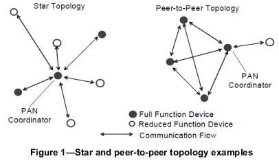
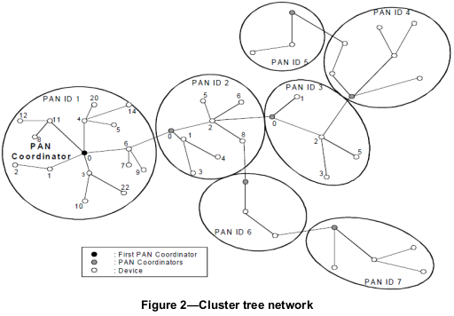
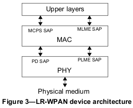
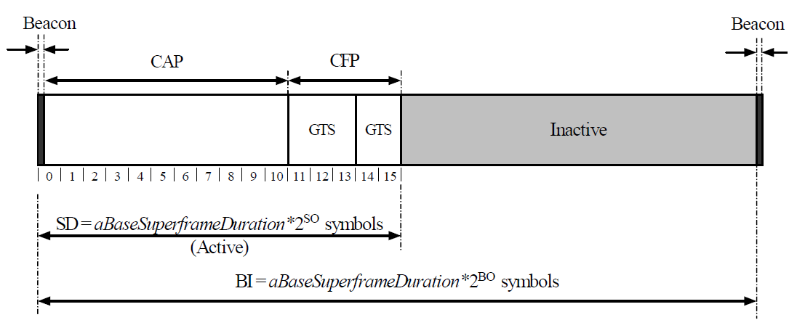
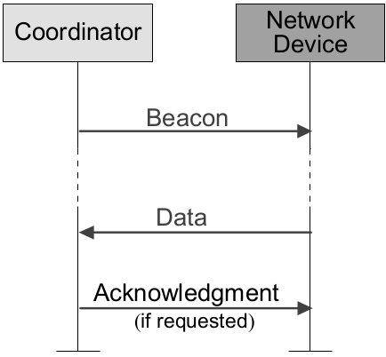
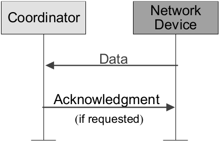

# IEEE802.15.4

+ [Instruction](# Instruction)
+ [Open project](# Open project)
+ [support IEEE802.15.4 radio](# support IEEE802.15.4 radio)

----

# Instruction 

The IEEE802.15.4 Task Group has been driving the development of low-power low-cost radio technology. The **Time slotted Channel Hopping** mode, added to the 2015 revision of the IEEE802.15.4 standard, is targeted at the embedded and industrial world, where reliability, energy consumption and cost drive the application space.  

The IEEE802.15.4 physical layer has been designed to support demanding low-power scenarios targeting the use of unlicensed bands, both the 2.4 GHz and sub GHz Industrial, Scientific and Medical (ISM) bands. This has imposed requirements in terms of frame size, data rate and bandwidth to achieve reduced collision probability, reduced packet error rate, and acceptable range with limited transmission power. The PHY layer supports frames of up to 127 bytes. The Medium Access Control (MAC) sublayer overhead is in the order of 10-20 bytes, leaving about 100 bytes to the upper layers. IEEE802.15.4 uses spread spectrum modulation such as the Direct Sequence Spread Spectrum (DSSS**. A 2012 amendment of the physical layer, known as IEEE802.15.4g has introduced new modulations including OFDM, supporting a large number of data rates and larger packet sizes up to 2047 bytes. This specification has been adopted by the WiSUN alliance to address metering use cases.  

The IEEE802.15.4 standard divides this band into 16 2MHz channels(0,1,..,15 channel offset) separated by 5MHz. It employs a 16-ary quasi-orthogonal modulation technique. During each data symbol period, four information bits are used to select one of 16 nearly orthogonal pseudo-random noise sequences to be transmitted. The sequences for successive data symbols are concatenated. This technique, known as Direct-Sequence Spread Spectrum (DSSS), increases receiver jamming resistance (the standard requires an Adjacent channel rejection of 0dB). The aggregate chip sequence is modulated onto the carrier using offset quadrature phase-shift keying (O-QPSK**.  

The standard requires a compliant device to be capable of achieving a sensitivity of 85dBm or better. In practice, chips achieving sensitivities between -95dBm and -100dBm are commonplace.   

Some of the capabilities provided by this standard are as follows:  

+ Star or peer-to-peer operation
+ Unique 64-bit extended address or allocated 16-bit short address
+ Optional allocation of guaranteed time slots (GTSs)
+ Carrier sense multiple access with collision avoidance (CSMA-CA) or ALOHA channel access
+ Fully acknowledged protocol for transfer reliability
+ Low power consumption
+ Energy detection (ED)
+ Link quality indication (LQI)

**Protocol Standard Version**  

+ IEEE802.15.4-2006 The purpose of this revision is to ****extend the market applicability of IEEE Std 802.15.4 and to remove ambiguities in the standard. Implementations of the 2003 edition of this standard have revealed potential areas of improvements. Additional frequency bands are being made available in various countries that are attractive for this application space.
+ IEEE802.15.4-2011(Emphasize the MAC protocol ) The standard provides for ultra low complexity, ultra low cost, ultra low power consumption, and low data rate wireless connectivity among inexpensive devices. The raw data rate is high enough (**250 kb/s**) to satisfy a set of applications but is also scaleable down to the needs of sensor and automation needs (20 kb/s or below) for wireless communications. Physical layers (PHYs) are defined for  

    - Devices operating in the license-free 868–868.6 MHz, 902–928 MHz, and 2400–2483.5 MHz bands
    - Devices with precision ranging, extended range, and enhanced robustness and mobility
    - Devices operating according the Chinese regulations, Radio Management of P. R. of China doc. #6326360786867187500 or current document, for one or more of the 314–316 MHz, 430–434 MHz,
and 779–787 MHz frequency bands
    - Devices operating in the 950–956 MHz allocation in Japan and coexisting with passive tag systems
in the band
+ IEEE802.15.4-2015(extend the MAC function(TDMA ..etc) support of legacy devices of the 780MHz, 915MHz and 2450 MHz O-QPSK PHYs

**Reference**  

+ "IEEE Standard for Low-Rate Wireless Networks," in IEEE Std 802.15.4-2015 (Revision of IEEE Std 802.15.4-2011) , vol., no., pp.1-709, 22 April 2016, doi: 10.1109/IEEESTD.2016.7460875.
+ Vilajosana X , Watteyne T , Chang T , et al. IETF 6TiSCH: A Tutorial[J]. IEEE Communications Surveys & Tutorials, 2019, PP(99:1-1.)
+ IEEE802.15.4-2006
+ IEEE802.15.4-2011

## Network topologies

Depending on the application requirements, an IEEE 802.15.4 LR-WPAN may operate in either of two topologies: the star topology or the peer-to-peer topology.  

||
|:----------------:|
|network topology  |

In the star topology the communication is established between devices and a single central controller, called the PAN coordinator. A device typically has some associated application and is either the initiation point or the termination point for network communications. A PAN coordinator may also have a specific application, but it can be used to initiate, terminate, or route communication around the network. The PAN coordinator is the primary controller of the PAN. All devices operating on a network of either topology shall have unique 64-bit addresses. This address may be used for direct communication within the PAN, or a short address may be allocated by the PAN coordinator when the device associates and used instead. The PAN coordinator might often be mains powered, while the devices will most likely be battery powered.   

Applications that benefit from a star topology include home automation, personal computer (PC peripherals, toys and games, and personal health care.  

The peer-to-peer topology also has a PAN coordinator; however, it differs from the star topology in that any device may communicate with any other device as long as they are in range of one another. Peer-to-peer topology allows more complex network formations to be implemented, such as mesh networking topology. Applications such as industrial control and monitoring, wireless sensor networks, asset and inventory tracking, intelligent agriculture, and security would benefit from such a network topology. A peer-to-peer network can be ad hoc, self-organizing, and self-healing. It may also allow multiple hops to route messages from any device to any other device on the network. Such functions can be added at the higher layer, but are not part of this standard.  

Each independent PAN selects a unique identifier. This PAN identifier allows communication between devices within a network using short addresses and enables transmissions between devices across independent networks. The mechanism by which identifiers are chosen is outside the scope of this standard.  

**Cluster tree network**  

The simplest form of a cluster tree network is a single cluster network, but larger networks are possible by forming a mesh of multiple neighboring clusters. Once predetermined application or network requirements are met, the first PAN coordinator may instruct a device to become the PAN coordinator of a new cluster adjacent to the first one. Other devices gradually connect and form a multicluster network structure, such as the one seen in Figure 2. The lines in Figure 2 represent the parent-child relationships of the devices and not the communication flow. The advantage of a multicluster structure is increased coverage area, while the disadvantage is an increase in message latency.  

||
|:----------------------------------:|
|Cluster tree network|

## Architecture

The IEEE 802.15.4 architecture is defined in terms of a number of blocks in order to simplify the standard. These blocks are called layers. Each layer is responsible for one part of the standard and offers services to the higher layers. The layout of the blocks is based on the open systems interconnection (OSI) seven-layer model (see ISO/IEC 7498-1:1994 [B12]).  

The interfaces between the layers serve to define the logical links that are described in this standard.  

An LR-WPAN device comprises a PHY, which contains the radio frequency (RF) transceiver along with its low-level control mechanism, and a MAC sublayer that provides access to the physical channel for all types of transfer.  

||
|:-------------------------------------------:|
|device architecture|

## PHY layer

The PHY provides two services: the PHY data service and the PHY management service interfacing to the physical layer management entity (PLME) service access point (SAP) (known as the PLME-SAP). The PHY data service enables the transmission and reception of PHY protocol data units (PPDUs) across the physical radio channel.  

The features of the PHY are activation and deactivation of the radio transceiver, ED, LQI, channel selection, clear channel assessment (CCA), and transmitting as well as receiving packets across the physical medium.  

The radio operates at one or more of the following unlicensed bands:  

+ 868–868.6 MHz (e.g., Europe)
+ 902–928 MHz (e.g., North America)
+ 2400–2483.5 MHz (worldwide)

## IEEE802.15.4 MAC sublayer

The MAC sublayer provides two services: the MAC data service and the MAC management service interfacing to the MAC sublayer management entity (MLME) service access point (SAP) (known as MLME-SAP). The MAC data service enables the transmission and reception of MAC protocol data units (MPDUs) across the PHY data service.  

The features of the MAC sublayer are beacon management, channel access, GTS management, frame validation, acknowledged frame delivery, association, and disassociation. In addition, the MAC sublayer provides hooks for implementing application-appropriate security mechanisms.(reference IEEE802.15.4-2006)  

The features of the MAC layer are:  

* real-time suitability by reservation of guaranteed time slots
* collision avoidance through CSMA/CA
* integrated support for secure communications (128-bit AES encryption)
* star and mesh topologies can theoretically be built
* support for low-latencies and dynamic device addressing

The IEEE802.15.4-2006(2015 version add TDMA other protocols) standard comes with a MAC protocols, which defines two channel access methods.  

* The Non-Beacon mode is a simple, traditional multiple access system used in simple peer networks. Medium access conflicts are resolved through standard CSMA. Successfully received packets are positively acknowledged.  

* The Beacon-Enabled mode follows a superframe structure, where a network coordinator transmits beacons at predetermined intervals. As shown below, following this beacons comes a Contention Access Period (CAP) where neighbors of the coordinator can talk to it following a slotted Aloha medium access scheme. During that period nodes can request a dedicated time slot in the Guaranteed Time Slot (GTS) period following the CAP.  

Beacons are are used to synchronize the attached devices, to identify the PAN, and to describe the structure of the superframes. Any device wishing to communicate during the contention access period (CAP) between two beacons competes with other devices using a slotted CSMA-CA mechanism. All transactions are completed by the time of the next network beacon.  

For low-latency applications or applications requiring specific data bandwidth, the PAN coordinator may dedicate portions of the active superframe to that application. These portions are called guaranteed time slots (GTSs). The GTSs form the contention-free period (CFP), which always appears at the end of the active superframe starting at a slot boundary immediately following the CAP. The PAN coordinator may allocate up to seven of these GTSs, and a GTS may occupy more than one slot period.  

||
|:---------------------------:|
|superframe-beacon|

### Transfer model

Three types of data transfer transactions exist.   

* The first one is the data transfer to a coordinator in which a device transmits the data. 
* The second transaction is the data transfer from a coordinator in which the device receives the data. 
* The third transaction is the data transfer between two peer devices. 

In star topology, only two of these transactions are used because data may be exchanged only between the coordinator and a device. In a peer-to-peer topology, data may be exchanged between any two devices on the network; consequently all three transactions may be used in this topology.  

The mechanisms for each transfer type depend on whether the network supports the transmission of beacons. A beacon-enabled PAN is used in networks that either **require synchronization or support for low-latency device** , such as PC peripherals. If the network does not need synchronization or support for low-latency devices, it can elect not to use the beacon for normal transfers. However, the beacon is still required for network discovery.  

1. Data transfer to a coordinator

When a device wishes to transfer data to a coordinator in a beacon-enabled PAN, it first listens for the network beacon. When the beacon is found, the device synchronizes to the superframe structure. At the appropriate time, the device transmits its data frame, using slotted CSMA-CA, to the coordinator. The coordinator may acknowledge the successful reception of the data by transmitting an optional acknowledgment frame.  

When a device wishes to transfer data in a nonbeacon-enabled PAN, it simply transmits its data frame, using unslotted CSMA-CA, to the coordinator. The coordinator acknowledges the successful reception of the data by transmitting an optional acknowledgment frame. The transaction is now complete.  

| ||
|:----:|:-------:|
|Communication to a coordinator in a beacon-enabled PAN|Communication to a coordinator in a nonbeacon-enabled PAN|

2. Data transfer from a coordinator

When the coordinator wishes to transfer data to a device in a beacon-enabled PAN, it indicates in the network beacon that the data message is pending. The device periodically listens to the network beacon and, if a message is pending, transmits a MAC command requesting the data, using slotted CSMA-CA. The coordinator acknowledges the successful reception of the data request by transmitting an acknowledgment frame. The pending data frame is then sent using slotted CSMA-CA or, if possible, immediately after the acknowledgment. The device may acknowledge the successful reception of the data by transmitting an optional acknowledgment frame. The transaction is now complete. Upon successful completion of the data transaction, the message is removed from the list of pending messages in the beacon.  

When a coordinator wishes to transfer data to a device in a nonbeacon-enabled PAN, it stores the data for the appropriate device to make contact and request the data. A device may make contact by transmitting a MAC command requesting the data, using unslotted CSMA-CA, to its coordinator at an application-defined rate. The coordinator acknowledges the successful reception of the data request by transmitting an acknowledgment frame. If a data frame is pending, the coordinator transmits the data frame, using unslotted CSMA-CA, to the device. If a data frame is not pending, the coordinator indicates this fact either in the acknowledgment frame following the data request or in a data frame with a zero-length payload. If requested, the device acknowledges the successful reception of the data frame by transmitting an acknowledgment frame.  

|||
|:----------------------:|:---------------------:|
|Communication from a coordinator a beacon-enabled PAN|Communication from a coordinator in a nonbeacon-enabled PAN|

3. Peer-to-peer data transfers

In a peer-to-peer PAN, every device may communicate with every other device in its radio sphere of influence. In order to do this effectively, the devices wishing to communicate will need to either receive constantly or synchronize with each other. In the former case, the device can simply transmit its data using unslotted CSMA-CA. In the latter case, other measures need to be taken in order to achieve synchronization. Such measures are beyond the scope of this standard.  

### Frame structure

* A beacon frame, used by a coordinator to transmit beacons
* A data frame, used for all transfers of data
* An acknowledgment frame, used for confirming successful frame reception
* A MAC command frame, used for handling all MAC peer entity control transfers

IEEE802.15.4-2006 defines two device classes. The Full Function Device (FFD) is capable of participating in any topology, when it can play the role of network coordinator; it is capable of talking to any other device. The Reduced Function Device (RFD) can only participate in a star topology, can only talk to a network coordinator, and cannot become a network coordinator. While the idea is for a RFD to require less hardware resource, in practice all IEEE802.15.4-2006 devices are FFDs.  

The MAC protocol of IEEE802.15.4-2006 is well suited for simple star topologies, While its MAC protocol enables the formation of extended multi-hop stars, such topologies suffer from the fact that many of nodes in the network need to have their radio always on (hence a duty cycle of 100%), and that communication in the network happens on a single channel.  

The goal of the IEEE802.15.4-2006 working group is to redesign the MAC protocol. In IEEE802.15.4e-2011 version enhance the MAC layer function and introduce the TSCH. In next file I will introduce the IEEE802.15.4e-TSCH mode.  

The concept of superframe and functional frame you could find in 2006 version(chapter 5) or over version. 

# Open project

this section introduce the implement IEEE802.15.4 protocol open project.  

## WALIBI

**Instruction**  

The 802.15.4-2006 standard protocol stack is implemented on CC2430, and the FreeRTOS operating system is used.

**Reference**  

+ Jean-François Wauthy, Laurent Schumacher. Implementation of an IEEE 802.15.4-2006 protocol stack on the Texas instrument CC2430, the 7th ACM workshop on Performance evaluation of wireless ad hoc, sensor, and ubiquitous networks, Bodrum, Turkey — October 17 - 21, 2010

----

## Chibi

This is an open source software project based on the original [Chibi](http://freaklabs.org/index.php/Chibi-A-Simple-Open-Source-Wireless-Stack.html) wireless protocol stack . This project ports the Chibi protocol stack to the Arduino platform so that people familiar with the Arduino will be able to communicate wirelessly using inexpensive IEEE 802.15.4 radios. Chibi means "midget" in Japanese and its appropriate for this stack because it strips wireless communications down to the fundamental operations of initialization, send, and receive. The stack relies heavily on the radio hardware to do most of the timing specific parts of the protocol which allows it to run without an operating system or a scheduler. This also reduces the size of the software which currently requires approximately 4 kB of flash memory and approximately 300 bytes of RAM.   

Chibi (a slightly derogatory Japanese term for 'midget') is an easy-to-use, open-source 802.15.4 wireless stack from Freaklabs.  It allows light-weight 'point-to-point' or 'point-to-multipoint' communications with a minimum of effort, and is currently based on the highly-integrated AT86RF212 (700-900MHz) and AT86RF230 (2.4GHz) transceivers from Atmel.  

A slightly modified version of Chibi is included in the LPC1343 Code Base and LPC1114 Code Base, allowing you to use it out of the box, though the only transceiver currently supported is the 700-900MHz AT86RF212 (800/900MHz offers significantly better signal penetration in an urban environment than 2.4GHz, though at the expense of slightly reduced transmit speeds).  This tutorial will show you how you can get started with Chibi using the LPC1114 or LPC1343.  

----

## msstatePAN

密西西比大学博士Robert B．Reese主持开发了开源精简协议栈msstatePAN.msstatePAN部分性能不兼容802.15.4／ZigBee，且不支持网状结构拓扑。由于其代码精简且完全开源，适合于初学者和实验研究人员进行开发研究。  

----

## A ZigbeeTM-subset/IEEE 802.15.4TM Multi-platform Protocol Stack

A protocol stack that supports coordinator/router/RFD nodes, tree routing, direct messaging, and indirect messaging using static binding. Platforms currently supported are:  

* Platform: PICDEM Z (PIC18 + CC2420 radio), Compiler: MCC18 or HI-TECH
* Platform: CC2430 Evaluation board/SOC_BB (CC2430/31 which has an 8051+802.15.4 Radio integrated in one die), Compiler: IAR51 or HI-TECH C51
* Platform: MSP430 + CC2420 (Tmote**, Compiler: mspgcc, Author: Rostislav Spinar
* Platform: WIN32 simulated RF nodes+ Virtual Board interface, Compiler: Microsoft Visual Studio .NET 2003

The target audiences of this stack are educational, research, and hobbyist users who are looking to experiment with private personal-area networks using available Zigbee/802.15.4 platforms. This stack only implements a very small subset of the Zigbee 1.0 standard, and is not Zigbee compliant. Use of this stack is non-restricted for research, educational, and personal use. Commercial use of the NWK, APS, APL layers of this stack is bound by the Zigbee Trademarks, Designations, and Logos Policy as these layers use Zigbee Alliance intellectual property.  

**Reference**  

+ A Zigbee-subset/IEEE 802.15.4 Multi-platform Protocol Stack

----

## ZigBit modules

[link](http://www.meshnetics.com)  

----

## Sensinode’s NanoStack 

there is an effort to add support for Sensinode/cc2430 hardware for the Contiki OS.  

相关链接已失效.  

**Reference**  

+ J. Flora,  P. Bonnet. Tiny15four: A portable, yet efficient 802.15.4 stack, IEEE 34th Conference on Local Computer Networks, 20-23 Oct. 2009

----

## OpenMAC

[OpenMAC](http://sourceforge.net/projects/openmac/) is a TinyOS-based implementation of IEEE 802.15.4 MAC layer, which lies at the core of MeshNetics ZigBee stack, and provides basic wireless networking (star,peer to peer) to WSN's. Available for low-power ZigBit modules and Atmel AVR Z-Link Kits  

## uracoli

[μracoli](http://www.nongnu.org/uracoli/) - The μController Radio Communication Library. The project intends to demonstrate capabilities and usage of Atmel's IEEE-802.15.4 radio transceivers (AT86RF230, AT86RF231, AT86RF212) in combination with AVR 8 bit microcontrollers (e.g. ATmega16, ATmega1281, ATtiny84, ...**.  

## Open-ZB

Implementation of IEEE 802.15.4 in nesC for TinyOS and Crossbow Micaz and TELOSb motes.  
[link](www.open-zb.net)  

Zigbee source code ,technology and open-ZB paper in the [ZigBee_sourcecode](ZigBee sourcecode).  

**Reference**  

+ A. Cunha, A. Koubaa, R. Severino and M. Alves, "Open-ZB: an open-source implementation of the IEEE 802.15.4/ZigBee protocol stack on TinyOS,** 2007 IEEE International Conference on Mobile Adhoc and Sensor Systems, Pisa, 2007, pp. 1-12, doi: 10.1109/MOBHOC.2007.4428602.

## IEEE 802.15.4 Model for OMNeT++/INET Framework

**Reference**  

+ Feng Chen, Nan Wang, Reinhard German, and Falko Dressler, "Performance Evaluation of IEEE 802.15.4 LR-WPAN for Industrial Applications," Proceedings of 5th IEEE/IFIP Conference on Wireless On demand Network Systems and Services (IEEE/IFIP WONS 2008), Garmisch-Partenkirchen, Germany, January 2008, pp. 89-96. [Abstract (english): HTML; Full text (english): PDF (l.4MB); BibTeX]
+ Feng Chen and Falko Dressler, "A Simulation Model of IEEE 802.15.4 in OMNeT++," Proceedings of 6. GI/ITG KuVS Fachgespr�ch Drahtlose Sensornetze, Poster Session, Aachen, Germany, July 2007, pp. 35-38. [Abstract (english): HTML; Full text (english): PDF (134kB); Poster (english): PDF (541kB); BibTeX]

## Wpan11
Low Rate Wireless Personal Area Networks (LR-WPANs)  

[link](http://www-ee.ccny.cuny.edu/zheng/pub/)  

**Reference**  

+ J. Zheng and Myung J. Lee, "Will IEEE 802.15.4 make ubiquitous networking a reality?-- a discussion on a potential low power, low bit rate standard," IEEE Communications Magazine, Vol. 42, No. 6, pp. 140-146, June 2004.

+ J. Zheng and Myung J. Lee, "A comprehensive performance study of IEEE 802.15.4," Sensor Network Operations, IEEE Press, Wiley Interscience, Chapter 4, pp. 218-237, 2006.

# support IEEE802.15.4 radio

First figure out the nouns:  

* 'mote' is a board with possibly various chips on it, like TelosB, CC2531EMK
* 'system-on-chip' is a single chip which contains both a micro-controller and a radio, like STM32WB55,nrf52840DK.
* 'micro-controllers' is a mcu which offers the compute service without radio transmit function, like stm32f10x,stm8x.
* 'IEEE802.15.4 radio' is a RF transceiver, like CC1101

## IEEE802.15.4 radios

Note 2016年Atmel被美国芯片制造商微芯科技（Microchip Technology）宣布以36亿美元收购。Freescale 被NXP收购  

|vendor|model|description|sensitivity|used in|
|------|-----|-----------|-----------|-------|
|Atmel|AT86RF212|Low Power 800/900 MHz Transceiver for IEEE 802.15.4- 2006 ZigbeeTM and ISM Applications|||
|Atmel|AT86RF215|dual-band sub-1GHz/2.4GHz transceiver compliant to IEEE 802.15.4-2011, IEEE 802.15.4g-2012, and ETSI TS 102 887-1|-123dBm||
|Atmel|AT86RF230|Low Power 2.4 GHz Radio Transceiver for ZigBee™ and IEEE 802.15.4™-2003 Applications|-101dBm|IRIS|
|Atmel|AT86RF231|High Performance RF-CMOS 2.4 GHz Radio Transceiver Targeted for IEEE 802.15.4™, ZigBee®, 6LoWPAN, RF4CE, SP100, WirelessHART™ and ISM Applications|-101dBm|GINA 2.2,OpenMoteStm|
|Atmel|AT86RF233|High Performance RF-CMOS 2.4GHz radio transceiver targeted for IEEE® 802.15.4, zigbee®, RF4CE, 6LoWPAN, and ISM applications|-101dBm||
|Microchip|AT86RF233|High Performance RF-CMOS 2.4GHz radio transceiver targeted for IEEE® 802.15.4, zigbee®, RF4CE, 6LoWPAN, and ISM applications|-101dBm||
|Microchip|MRF24J40/MA/MD|complete IEEE 802.15.4 radio and operates in the 2.4GHz freq band,supports ZigBee™ and MiWi™ protocols|-95dBm||
|Freescale|MC13192|contains a complete 802.15.4-2006 physical layer (PHY) modem designed for the IEEE® 802.15.4 Standard which supports peer-to-peer,star, and mesh networking.|-92dBm||
|Freescale|MC13201|contains a complete packet data modem which is compliant with the IEEE® 802.15.4 Standard PHY (Physical) layer|-91dBm||
|Freescale|MC13202|contains a complete 802.15.4 physical layer (PHY) modem designed for the IEEE® 802.15.4 Standard which supports peer-to-peer,star, and mesh networking|-92dBm||
|Texas Instruments|TI CC1101|low-power wireless applications operating in the 315/433/868/915 MHz ISM/SRD bands,**chip**, support openwsn|-116dBm||
|Texas Instruments|TI CC1200|high performance low power RF transceivers designed for operation with a companion MCU,support openwsn|-128dBm||
|Texas Instruments|TI CC2420|a true single-chip 2.4 GHz IEEE 802.15.4 compliant RF transceiver designed for low power and low voltage wireless applications(only radio)|-95dBm|TelosB,MICAz,SunSpot,EPIC|
|Texas Instruments|TI CC2520|2.4 GHZ IEEE 802.15.4/ZIGBEE® RF TRANSCEIVER(only radio)|-98dBm||
|Texas Instruments|TI CC2530|True System-on-Chip Solution for 2.4-GHz IEEE 802.15.4 and ZigBee Applications(contain CPU and radio)|-98dBm||
|Texas Instruments|TI CC2538|CC2538 适用于 2.4GHz IEEE 802.15.4、6LoWPAN 和 ZigBee®应用的强大无线微控制器片上系统(contain CPU and radio)|||
|Nordic|nrf52840|support for Bluetooth 5, Bluetooth mesh, Thread, Zigbee, 802.15.4, ANT and 2.4 GHz proprietary stacks(contain CPU and radio)|||

