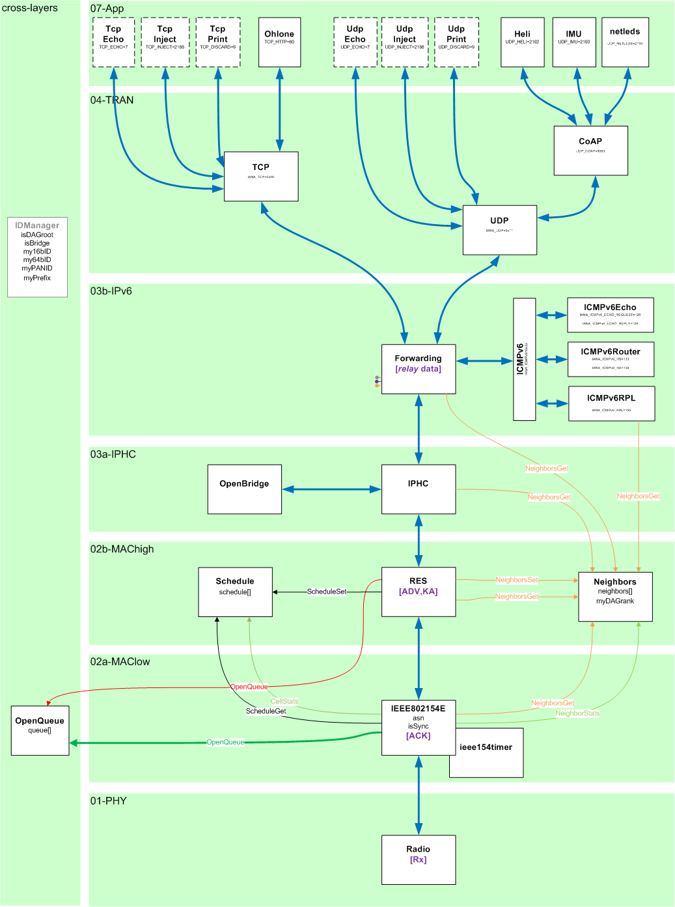

# Openwsn stack organize

* [Instruction](## Instruction)
* [Packet structure](## Packet structure)
* [Layer Interaction](## Layer interaction)
* [Reference](## Reference)

## Instruction

This section details how the different layer forming the protocol stack interact by describing the structure of the packets traveling over the network, including headers from all layers.  

||
|:-------------------------------------------:|
|stack organization|

## Packet structure

There are a total of 7 frame formats(function frame other than IP/MAC frame), each represented on a different page in standard [_frame_formats.xlsx](standard_frame_formats.xlsx). For easier reading, different headers are represented in different colors, with a "newline" at header change. Each bit is represented, multiple bits are groups into sub-fields, which can be grouped into fields if applicable. Bits set as '.' are variable value fields (e.g. a timestamp); bits written in black are specified by the standards; bits in bold-green are conventions we adopted (e.g. using a PAN ID of 14). The IEEE802.15.4e draft standard is unclear about the value of the Frame Version field, it is therefore left in bold-red question marks. The names of the header are written vertically on the left, the length of each and the total packet length is written on the right.  

## Layer interaction

The 7 frames are the following.

### L2 advertisement

This frame is exchanged between neighbor IEEE802.15.4 layers and it does never transport upper-layer payload; only the IEEE802.15.4 and IEEE802.15.4e headers are hence present. It is regularly transmitted by all the nodes in the network to indicate that the network exists. Note that the Destination address is set to 0xFFFF, the broadcast address. A new node will start by listen to that packet and, upon hearing, can choose to join the network. The IEEE802.15.4e header indicates the capability of the network, enabling the new node to make an educated decision on whether or not to join the network. In particular, it indicates on which channels the network is hopping (Channel Page and Channel Map), on which cell the new node can contact the emitter if it wishes to join (Link Info) and what time it is in the network (Timing information, contains the current Absolute Slot Number ASN). Note that this frame is not acknowledged as not sent to a specific node (Acknowledgment requested is set to 0)  

### L2 join

This frame is exchanged between neighbor IEEE802.15.4 layers and it does never transport upper-layer payload; only the IEEE802.15.4 and IEEE802.15.4e headers are hence present. This is used by a new node to indicate it wishes to join the network. The new node sends this frame to the source of an advertisement command frame it received earlier. The new node indicates whether is has a crystal oscillator with an accuracy of $10ppm$ or less (10ppm capable) and lists the neighbor it has. Note that this frame is acknowledged (Acknowledgment requested is set to 1).  

### L2 activate

This frame is exchanged between neighbor IEEE802.15.4 layers and it does never transport upper-layer payload; only the IEEE802.15.4 and IEEE802.15.4e headers are hence present. If the new node is consider fit for the network, it receives an activate frame from the node it sent the join frame to. In the join frame, the new node, which had used its 64-bit address so far, receives a 16-bit short identifier in the Short Address field. Also, the sender of this frame indicates its own 16-bit identifier in the Source Address field. Note that this frame is acknowledged (Acknowledgment requested is set to 1).  

### L2 acknowledgment

This frame is exchanged between neighbor IEEE802.15.4 layers and it does never transport upper-layer payload; only the IEEE802.15.4 and IEEE802.15.4e headers are hence present. Acknowledgment are sent to any packet which has its Acknowledgment requested bit is set to 1; in practice all frames except the advertisement. This frame can be positive (most cases) or negative by setting the ACK/NACK type field to something different than 0b00. Negative ACKs can happen when the buffer of the receiving node is full. The acknowledgment indicate how late or early the sender received the frame it is acknowledging; this allows the receiver of the ACK to adjust its clock, provide the sender of the ACK is its time parent.  

### L3 DIO

This frame is exchanged between neighbor RPL layers and it does never transport upper-layer payload. Only the IEEE802.15.4, IEEE802.15.4e, 6LoWPAN and RPL headers are hence present. Note that the Frame Type field of the IEEE802.15.4 header is set to 0b001, indicating a data packet. DIO packets are signaling messages used by the routing protocol to set up routes towards the gateway. A DIO is in fact a type of ICMPv6 RPL Control Message, so a 6LoWPAN header is used. Note that, because the DIO is sent between neighbors only, the source and destination addresses can be elided from the 6LoWPAN header (SAM=0b11 and DAM=0b11) and the hop limit is always 1, hence HLIM=0b01 and the IPv6 Ho Limit field is elided. DAGrank is probably the most important field of the DIO as it allows a node to calculate its own rank.  

### L3 DAO

This frame is exchanged between the RPL layers of source and destination nodes possibly multiple hops away, yet it does never transport upper-layer payload. Only the IEEE802.15.4, IEEE802.15.4e, 6LoWPAN and RPL headers are hence present. Note that the Frame Type field of the IEEE802.15.4 header is set to b001, indicating a data packet. Because source and destination can be hops away, the 6LoWPAN header does not elide the IPv6 source and destination fields. Similarly, the IPv6 Flow Label field is used by RPL to perform loop control.  

### L7 data

This frame is exchanged between the application layers of source and destination nodes possibly multiple hops away. All the header are hence present (IEEE802.15.4, IEEE802.15.4e, 6LoWPAN and UDP), except the RPL as this packet is handled by the forwarding engine of layer 3, not the routing protocol. Similarly to the DAO which also travels multiple hops, IPv6 Source, Destination and Flow Label can not be elided by 6LoWPAN.  

### Reference

+ https://openwsn.atlassian.net/wiki/spaces/OW/pages/688161/The+Big+Picture

